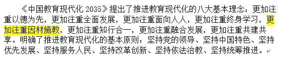
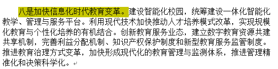

### 政策支持：

- 《中国教育现代化2035》提出了推进教育现代化的八大基本理念： 更加注重因材施教  

- 《中国教育现代化2035》提出，推进教育现代化的总体目标 ，到2035年，总体实现教育现代化  
- 《中国教育现代化2035》聚焦教育发展的突出问题和薄弱环节，立足当前，着眼长远，重点部署了面向教育现代化的十大战略任务：         八是加快信息化时代教育变革。  

### 题目

“助力因材施教”——人工智能在教学方法改革上的实践应用

### 方案重点

- 

