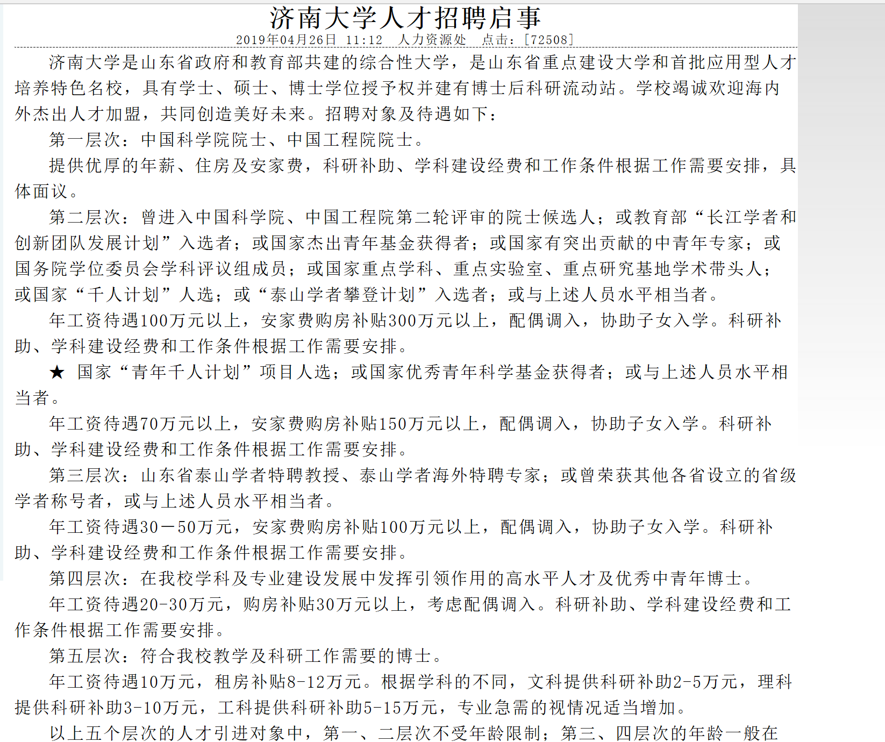
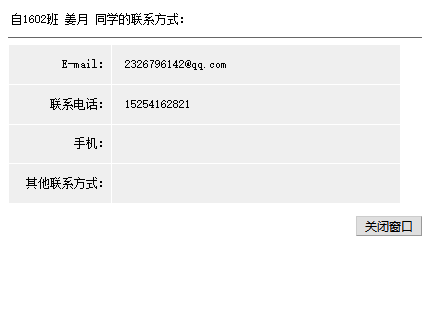
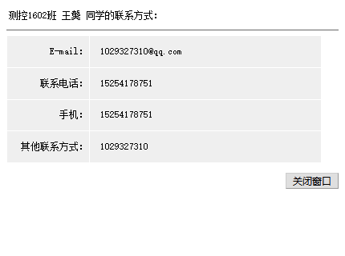

# 一些基础信息

- 工号：021971204266
- 704wifi密码：robot111
- 邮箱：cse_liy@ujn.edu.cn

# 一些常见问题

### histcite中txt处理

- TXT文本放在C:\fakepath路径下，否则提示路径不对
- 下载下来的TXT文本，用记事本打开，将第一行的“FN Thomson Reuters Web of KnowledgeVR“（不包括引号）替换成”FN ISI Export FormatVR“，另存为txt文本，编码选择ANSI；否则提示格式不对

# 2019

---

### 入职

 [济南大学聘用合同.pdf](file\2019\济南大学聘用合同.pdf) 

---

### 职称材料

 [济大校字〔2019〕135号—关于印发《济南大学2019年专业技术职务（岗位）评聘工作实施办法》的通知(1).pdf](file\2019\济大校字〔2019〕135号—关于印发《济南大学2019年专业技术职务（岗位）评聘工作实施办法》的通知(1).pdf) 

 [自动化学院2019年度专业技术职务申报个人情况简表-副教授.pdf](file\2019\自动化学院2019年度专业技术职务申报个人情况简表-副教授.pdf) 

---

济南大学vpn

 [济南大学vpn.pdf](file\2019\济南大学vpn.pdf) 

# 2020

## 01~

------

### 本科毕设

 [2020届毕业设计（论文）题目申报表-申报文档（参考）.doc](file\2020\2020届毕业设计（论文）题目申报表-申报文档（参考）.doc) 

 [2020届毕业设计题目建议申报数量.xls](file\2020\2020届毕业设计题目建议申报数量.xls) 

 [2020题目1.doc](file\2020\2020题目1.doc) 

 [2020题目2.doc](file\2020\2020题目2.doc) 

 [关于2020届毕业设计题目申报及选题时间安排的通知(1).doc](file\2020\关于2020届毕业设计题目申报及选题时间安排的通知(1).doc) 

#### 会议记录

[2020毕设会议记录.docx](file\2020\2020毕设会议记录.docx) 

#### 学生遇到的问题

- 工具安装，可以将工具安装到虚拟机然后传输给学生
- matlab需要用到的工具箱及添加到matlab
- matlab dir命令

#### 相关资料

- [MATLAB在语音信号分析与合成中的应用pdf](file\2020\MATLAB在语音信号分析与合成中的应用pdf)
-  [matlab在语音信号分析和合成中的应用[程序源代码].rar](file\2020\matlab在语音信号分析和合成中的应用[程序源代码].rar) 

---

杨雪岩老师让收集老师银行卡号

---

### 周村上课

---

## 02~

---

### 疫情期间网络教学

- 超星教学视频：https://zhibo.chaoxing.com//pcliveAddress?streamName=LIVENEW32tEI8F3&vdoid=39448X2lR31
-  [济南大学关于成立在线教学服务保障工作组及开展2020年第一期在线教学培训的通知.pdf](file\2020\济南大学关于成立在线教学服务保障工作组及开展2020年第一期在线教学培训的通知.pdf) 
-  

---

### 模电及课设教学

 [模电点名册.xls](file\2020\模电点名册.xls) 

 [模拟电子技术课程设计点名册.xls](file\2020\模拟电子技术课程设计点名册.xls) 

